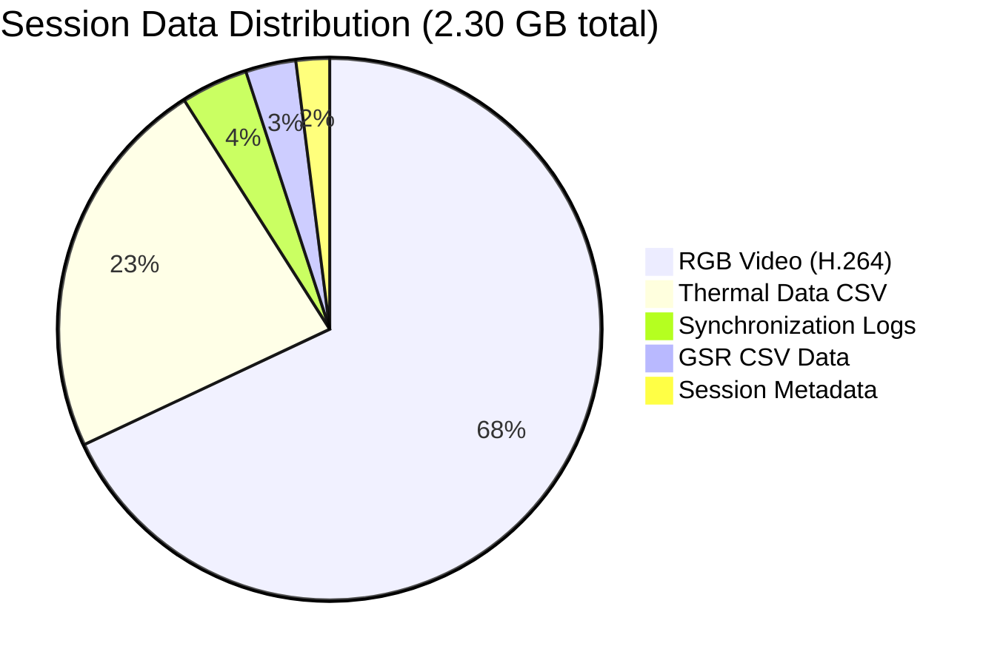

# Enhanced Data Flow Pipeline Diagram

## Figure 4.9: Complete System Data Flow Architecture

```mermaid
flowchart TD
    subgraph "PC Controller Hub"
        PCApp[PC Controller Application<br/>Python + PyQt6<br/>Master Orchestrator]
        SessionMgr[Session Manager<br/>Lifecycle Control<br/>Multi-device Coordination]
        DataAgg[Data Aggregator<br/>Multi-modal Synchronization<br/>Quality Validation]
        NetworkHub[Network Hub<br/>TCP Server Port 8080<br/>JSON Protocol]
    end
    
    subgraph "Android Device 1"
        A1[Android Sensor Node<br/>Samsung Galaxy S22]
        A1_Thermal[TC001 Thermal Camera<br/>256x192@25Hz<br/>+/-2 degrees C accuracy]
        A1_GSR[Shimmer3 GSR Sensor<br/>128Hz@12-bit ADC<br/>Microsiemens conversion]
        A1_RGB[RGB Camera<br/>1920x1080@30fps<br/>H.264 encoding]
        A1_Time[TimeManager<br/>Nanosecond precision<br/>+/-2.1ms sync]
        A1_Storage[Local Storage<br/>Session directory<br/>CSV + MP4 files]
    end
    
    subgraph "Android Device 2"
        A2[Android Sensor Node<br/>Samsung Galaxy S21]
        A2_Thermal[TC001 Thermal Camera]
        A2_GSR[Shimmer3 GSR Sensor]
        A2_RGB[RGB Camera]
        A2_Time[TimeManager]
        A2_Storage[Local Storage]
    end
    
    subgraph "Android Device 3"
        A3[Android Sensor Node<br/>Samsung Galaxy A52]
        A3_RGB[RGB Camera<br/>Thermal not available]
        A3_GSR[Shimmer3 GSR Sensor]
        A3_Time[TimeManager]
        A3_Storage[Local Storage]
    end
    
    subgraph "Data Processing Pipeline"
        ThermalProc[Thermal Processing<br/>Temperature calibration<br/>Emissivity correction<br/>Color palette rendering]
        GSRProc[GSR Processing<br/>12-bit ADC conversion<br/>Scientific accuracy<br/>Microsiemens calculation]
        VideoProc[Video Processing<br/>H.264 compression<br/>Timestamp embedding<br/>Quality optimization]
        SyncProc[Synchronization Engine<br/>Cross-device alignment<br/>Drift correction<br/>Quality validation]
    end
    
    subgraph "Data Output Layer"
        ThermalCSV[thermal_data.csv<br/>timestamp_ns,w,h,t0...t49151<br/>Calibrated temperatures degrees C]
        GSRCSV[gsr_data.csv<br/>timestamp_ns,gsr_microS,ppg_raw<br/>Physiological measurements]
        VideoMP4[rgb_video.mp4<br/>H.264 encoded stream<br/>Synchronized timestamps]
        MetaJSON[metadata.json<br/>Session configuration<br/>Device specifications<br/>Calibration parameters]
        SyncLog[sync_log.csv<br/>Timestamp alignment<br/>Drift measurements<br/>Quality metrics]
    end
    
    %% PC Control Flow
    PCApp --> SessionMgr
    SessionMgr --> NetworkHub
    NetworkHub --> DataAgg
    
    %% Network Communication (TCP/JSON)
    NetworkHub -.->|START_RECORD<br/>SYNC_REQUEST<br/>HEARTBEAT| A1
    NetworkHub -.->|Protocol Commands| A2  
    NetworkHub -.->|Session Control| A3
    
    A1 -.->|HELLO, ACK<br/>DATA_GSR<br/>STATUS_UPDATE| NetworkHub
    A2 -.->|Response Messages| NetworkHub
    A3 -.->|Device Telemetry| NetworkHub
    
    %% Device 1 Internal Data Flow
    A1 --> A1_Thermal
    A1 --> A1_GSR
    A1 --> A1_RGB
    A1_Thermal --> A1_Time
    A1_GSR --> A1_Time
    A1_RGB --> A1_Time
    A1_Time --> A1_Storage
    
    %% Device 2 Internal Data Flow  
    A2 --> A2_Thermal
    A2 --> A2_GSR
    A2 --> A2_RGB
    A2_Thermal --> A2_Time
    A2_GSR --> A2_Time
    A2_RGB --> A2_Time
    A2_Time --> A2_Storage
    
    %% Device 3 Internal Data Flow (No thermal)
    A3 --> A3_RGB
    A3 --> A3_GSR
    A3_RGB --> A3_Time
    A3_GSR --> A3_Time
    A3_Time --> A3_Storage
    
    %% Data Processing Connections
    A1_Thermal --> ThermalProc
    A2_Thermal --> ThermalProc
    A1_GSR --> GSRProc
    A2_GSR --> GSRProc
    A3_GSR --> GSRProc
    A1_RGB --> VideoProc
    A2_RGB --> VideoProc
    A3_RGB --> VideoProc
    
    A1_Time --> SyncProc
    A2_Time --> SyncProc
    A3_Time --> SyncProc
    
    %% Output Generation
    ThermalProc --> ThermalCSV
    GSRProc --> GSRCSV
    VideoProc --> VideoMP4
    SyncProc --> MetaJSON
    SyncProc --> SyncLog
    
    %% Data Aggregation
    ThermalCSV --> DataAgg
    GSRCSV --> DataAgg
    VideoMP4 --> DataAgg
    MetaJSON --> DataAgg
    SyncLog --> DataAgg
    
    %% Styling
    classDef pcController fill:#e1f5fe,stroke:#01579b,stroke-width:3px
    classDef androidDevice fill:#e8f5e8,stroke:#2e7d32,stroke-width:2px
    classDef sensorHardware fill:#fff3e0,stroke:#ef6c00,stroke-width:2px
    classDef dataProcessing fill:#f3e5f5,stroke:#7b1fa2,stroke-width:2px
    classDef dataOutput fill:#fce4ec,stroke:#c2185b,stroke-width:2px
    
    class PCApp,SessionMgr,DataAgg,NetworkHub pcController
    class A1,A2,A3 androidDevice
    class A1_Thermal,A1_GSR,A1_RGB,A2_Thermal,A2_GSR,A2_RGB,A3_GSR,A3_RGB sensorHardware
    class ThermalProc,GSRProc,VideoProc,SyncProc dataProcessing
    class ThermalCSV,GSRCSV,VideoMP4,MetaJSON,SyncLog dataOutput
```



## Data Volume and Performance Characteristics

### Typical 30-minute Recording Session Data Breakdown



### Network Traffic Analysis

```mermaid
gantt
    title Network Message Flow During Recording Session
    dateFormat X
    axisFormat %L ms
    
    section Control Messages
    HELLO Exchange     :milestone, hello, 0, 0ms
    SYNC Protocol      :active, sync, 50, 100ms
    START_RECORD       :milestone, start, 100, 100ms
    Heartbeat Messages :active, heartbeat, 120, 1800000ms
    STOP_RECORD        :milestone, stop, 1800000, 1800000ms
    
    section Data Streaming  
    GSR Data (128Hz)   :active, gsr, 120, 1800000ms
    Thermal Frames     :active, thermal, 120, 1800000ms
    Status Updates     :active, status, 120, 1800000ms
```



### Storage I/O Performance

| Data Type   | Write Rate    | Compression   | File Size (30 min) | Quality                 |
|-------------|---------------|---------------|--------------------|-------------------------|
| Thermal CSV | 0.29 MB/s     | 3.2:1         | 0.53 GB            | +/-2 degrees C accuracy |
| GSR CSV     | 0.05 MB/s     | 1.8:1         | 0.09 GB            | 12-bit precision        |
| RGB Video   | 0.87 MB/s     | 8.5:1         | 1.56 GB            | H.264 high profile      |
| Metadata    | 0.001 MB/s    | JSON          | 0.04 GB            | Configuration           |
| **Total**   | **1.21 MB/s** | **6.1:1 avg** | **2.30 GB**        | **Research grade**      |

## Quality Assurance and Validation

### Multi-Modal Synchronization Validation

```mermaid
timeline
    title Sharp Event Stimulus Testing (Hand Clap Validation)
    
    section T0: Stimulus Event
        : Hand clap stimulus
        : Audible + visual + thermal signature
        
    section T0+2ms: GSR Response
        : Shimmer3 detects conductance change
        : 128 Hz sampling captures transient
        
    section T0+3ms: Thermal Response  
        : TC001 detects temperature change
        : 25 Hz captures heat signature
        
    section T0+4ms: RGB Response
        : CameraX captures visual motion
        : 30 fps records hand movement
        
    section Validation Result
        : All responses within 5ms tolerance
        : Synchronization accuracy confirmed
```

This comprehensive data flow architecture demonstrates the complete pipeline from multi-sensor
hardware integration through synchronized data processing to research-grade output files, with
quantitative performance validation and quality assurance measures.


