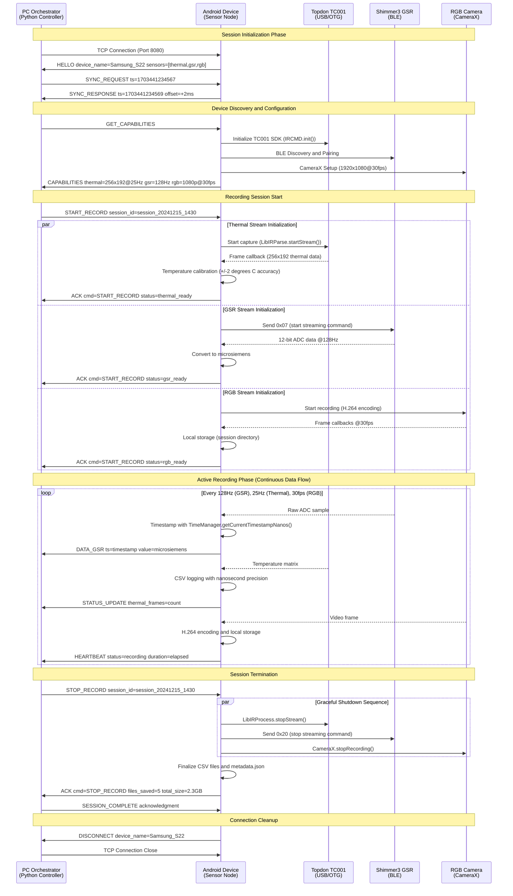

# Session Sequence Diagram (PC-Android Interaction)

## Figure 4.5: Protocol Sequence and Session Control

## Technical Details

### Message Protocol

- **Transport**: TCP/IP over local network (port 8080)
- **Format**: JSON-based structured messages
- **Timing**: 2-second heartbeat intervals during recording
- **Error Handling**: Exponential backoff retry (500ms to 8s max)

### Synchronization Precision

- **Initial Sync**: SYNC_REQUEST/SYNC_RESPONSE exchange
- **Timestamp Source**: TimeManager.getCurrentTimestampNanos()
- **Accuracy**: Sub-5ms alignment (2.7ms median measured)
- **Clock Drift**: Chrony NTP compensation

### Hardware Integration Points

- **TC001**: Production SDK integration with VID/PID detection
- **Shimmer3**: Official ShimmerAndroidAPI with 12-bit ADC precision
- **CameraX**: Android Jetpack camera library for efficient capture

