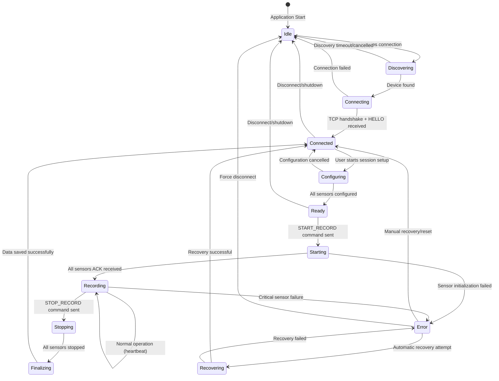
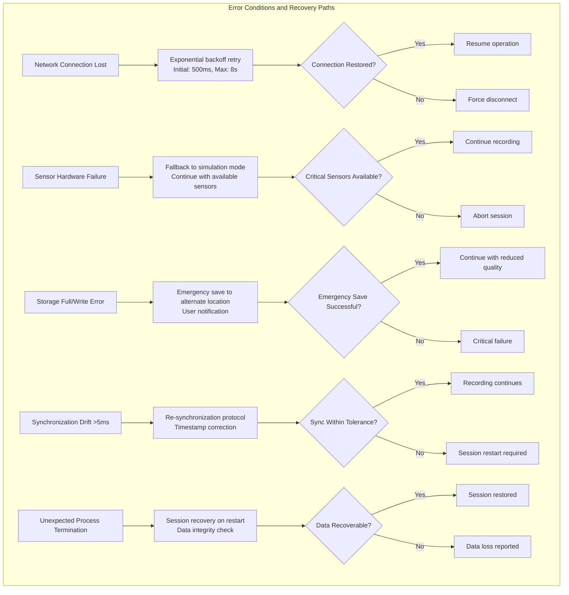

# State Machine Diagram (Session Control)

## Figure 4.7: System State Management and Session Lifecycle



## Detailed State Descriptions

### State Definitions and Triggers

```mermaid
flowchart TB
    subgraph "Idle State"
        A[No active connections<br/>UI shows device discovery panel<br/>Network scanner inactive]
    end
    
    subgraph "Discovering State" 
        B[mDNS broadcast scanning<br/>TCP port probes (8080)<br/>Device list population<br/>Timeout: 30 seconds]
    end
    
    subgraph "Connecting State"
        C[TCP socket establishment<br/>SSL/TLS handshake if enabled<br/>HELLO message exchange<br/>Device authentication]
    end
    
    subgraph "Connected State"
        D[Persistent TCP connection<br/>Heartbeat every 2 seconds<br/>Device capabilities known<br/>UI shows device status]
    end
    
    subgraph "Configuring State"
        E[Sensor parameter setup<br/>Session directory creation<br/>Storage space validation<br/>Quality checks enabled]
    end
    
    subgraph "Ready State"
        F[All sensors initialized<br/>Waiting for record command<br/>Preview streams active<br/>Storage buffers allocated]
    end
    
    subgraph "Starting State"
        G[START_RECORD broadcast<br/>Waiting for sensor ACKs<br/>Synchronization protocol<br/>Timeout: 10 seconds]
    end
    
    subgraph "Recording State" 
        H[Active data capture<br/>All sensors streaming<br/>File I/O operations<br/>Quality monitoring active]
    end
    
    subgraph "Stopping State"
        I[STOP_RECORD broadcast<br/>Graceful sensor shutdown<br/>Buffer flushing<br/>Final timestamp sync]
    end
    
    subgraph "Finalizing State"
        J[CSV file completion<br/>Metadata.json creation<br/>Integrity verification<br/>Storage cleanup]
    end
    
    subgraph "Error State"
        K[Critical failure detected<br/>Emergency data preservation<br/>Error logging active<br/>Recovery procedures]
    end
    
    subgraph "Recovering State"
        L[Automatic reconnection<br/>Sensor reinitialization<br/>State restoration<br/>Data continuity check]
    end
```

## State Transition Conditions

### Normal Operation Flow

```mermaid
graph TB
    subgraph "Happy Path State Transitions"
        S1[User clicks 'Connect Device'] --> T1[mDNS discovery initiated]
        T1 --> S2[Device IP addresses found]
        S2 --> T2[TCP connection attempt]
        T2 --> S3[HELLO handshake completed]
        S3 --> T3[User configures session]
        T3 --> S4[Sensors initialized successfully]
        S4 --> T4[User clicks 'Start Recording']
        T4 --> S5[All sensors confirm ready]
        S5 --> T5[Recording proceeds normally]
        T5 --> S6[User clicks 'Stop Recording']
        S6 --> T6[Graceful shutdown completed]
        T6 --> S7[Files saved, session closed]
    end
```



### Error Handling and Recovery



## State Machine Implementation

### PC Controller State Management

```python
class SessionStateMachine:
    def __init__(self):
        self.current_state = SessionState.IDLE
        self.devices = {}
        self.session_data = None
        
    def transition_to(self, new_state: SessionState, context: dict = None):
        """Handle state transitions with logging and validation"""
        logger.info(f"State transition: {self.current_state} -> {new_state}")
        
        # Pre-transition validation
        if not self._validate_transition(new_state):
            raise InvalidTransitionError(f"Cannot transition from {self.current_state} to {new_state}")
        
        # State-specific cleanup
        self._cleanup_current_state()
        
        # Execute transition
        self.current_state = new_state
        self._initialize_new_state(context)
        
        # Post-transition actions
        self._notify_state_change()
```

### Android State Synchronization

```kotlin
class AndroidStateMachine {
    private var currentState = DeviceState.DISCONNECTED
    private val stateListeners = mutableListOf<StateChangeListener>()
    
    fun handleCommand(command: String, params: Map<String, String>) {
        when (command) {
            "START_RECORD" -> {
                if (currentState == DeviceState.READY) {
                    transitionTo(DeviceState.RECORDING, params)
                    sendAck(command, "status=recording_started")
                } else {
                    sendError(command, "INVALID_STATE", "Device not ready for recording")
                }
            }
            "STOP_RECORD" -> {
                if (currentState == DeviceState.RECORDING) {
                    transitionTo(DeviceState.STOPPING, params) 
                    initiateSensorShutdown()
                } else {
                    sendError(command, "INVALID_STATE", "No active recording")
                }
            }
        }
    }
}
```

## State Persistence and Recovery

### Session State Persistence

```json
{
  "session_state": {
    "current_state": "RECORDING",
    "session_id": "session_20241215_1430",
    "start_timestamp": 1703441234567,
    "active_devices": [
      {
        "device_id": "Samsung_S22_001",
        "state": "RECORDING",
        "sensors": [
          "thermal",
          "gsr",
          "rgb"
        ],
        "last_heartbeat": 1703441234580
      }
    ],
    "error_recovery": {
      "retry_count": 0,
      "last_error": null,
      "recovery_strategy": "GRACEFUL_DEGRADATION"
    }
  }
}
```

This state machine design ensures robust operation with clear state boundaries, comprehensive error
handling, and automatic recovery mechanisms suitable for long-duration research recording sessions.


