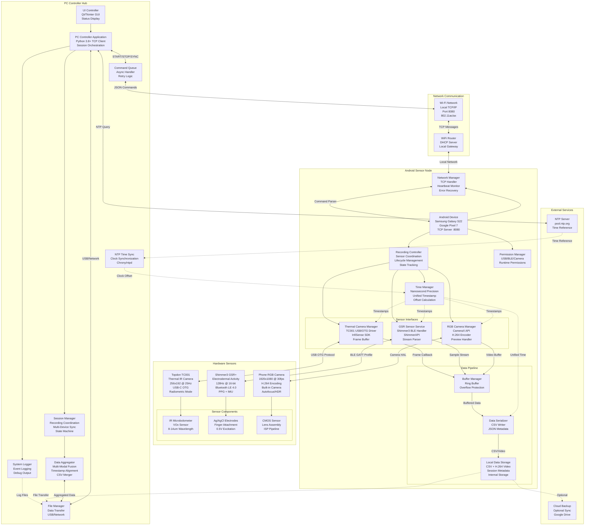

# Chapter 1: Multi-Sensor System Overview

            ## Figure 1.1: Multi-Sensor System Overview

            A high-level diagram illustrating the smartphone-based system with attached sensors, the PC controller,
            and all communication links.

