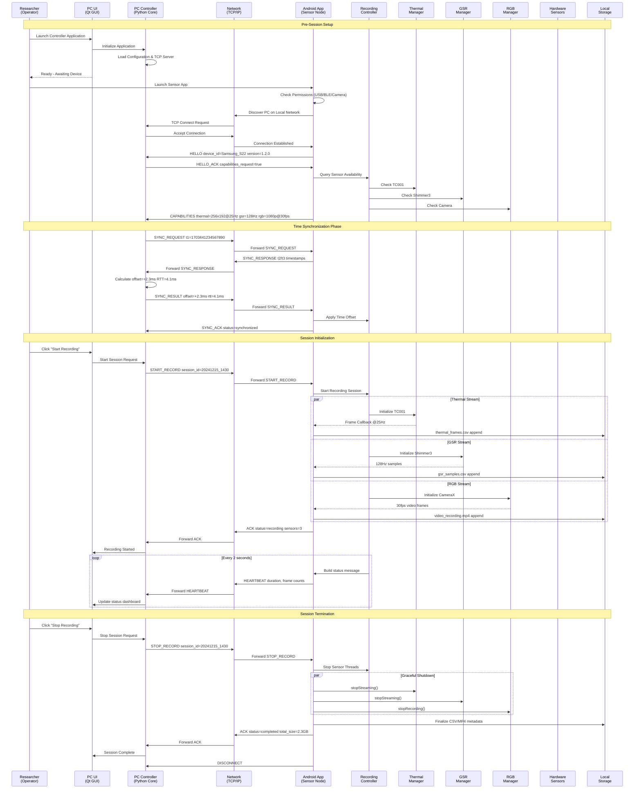

# Chapter 1: Example Use-Case Scenario Timeline

## Figure 1.2: Example Use-Case Scenario Timeline

A detailed sequence diagram showing a typical recording session workflow, including synchronization and
remote control interactions.

