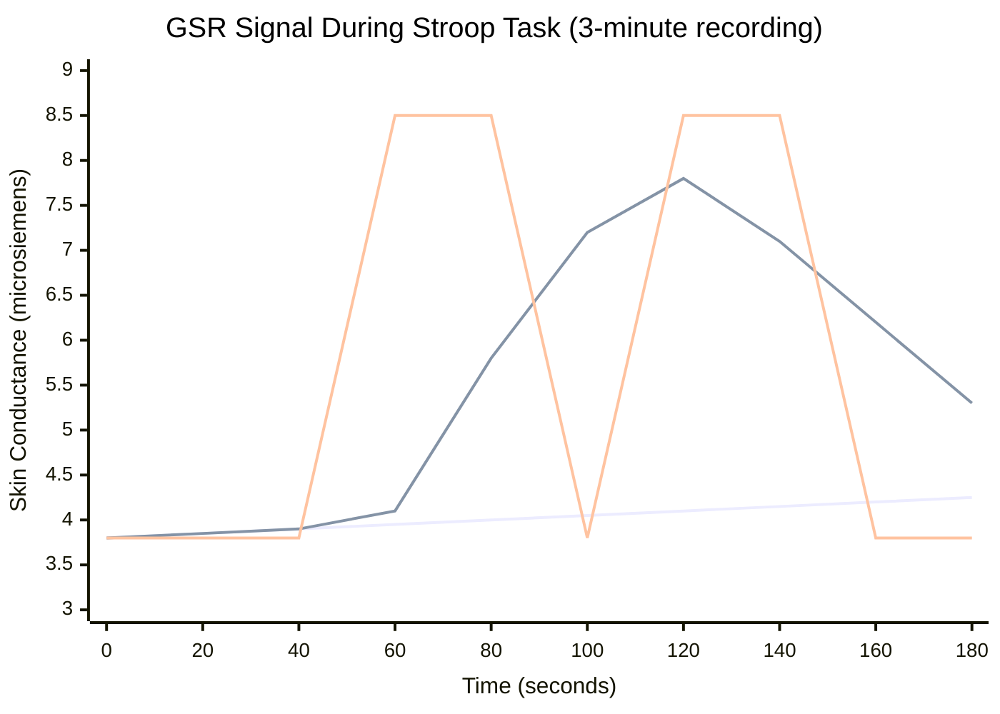
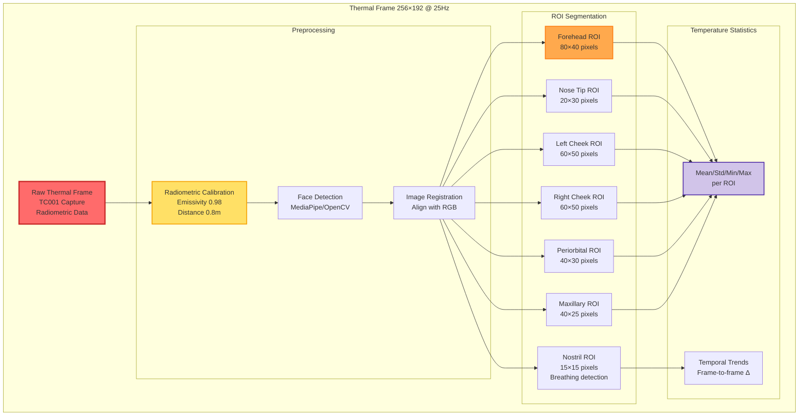

# Chapter 2: Basic GSR and Thermal Data Examples

## Figure 2.1: Basic GSR and Thermal Data Examples

Illustrative diagrams showing representative GSR traces and thermal ROI processing.

### Part A: Sample GSR (Electrodermal Activity) Signal

### Part B: Thermal Image Analysis and ROI Extraction

