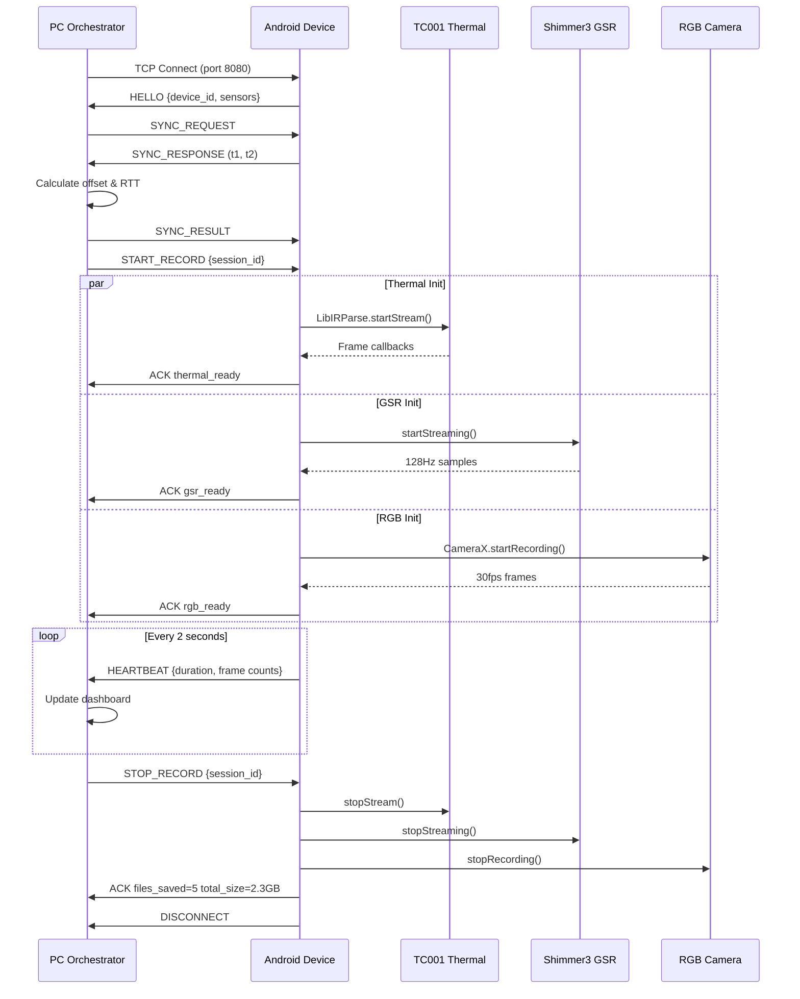

# Chapter 3: Communication Sequence Diagram

## Figure 3.3: Communication Sequence Diagram (PC–Device Interaction)

```mermaid
sequenceDiagram
    participant PC as PC Orchestrator
    participant Android as Android Device
    participant Thermal as TC001 Thermal
    participant GSR as Shimmer3 GSR
    participant Camera as RGB Camera

    PC->>Android: TCP Connect (port 8080)
    Android->>PC: HELLO {device_id, sensors}
    PC->>Android: SYNC_REQUEST
    Android->>PC: SYNC_RESPONSE (t1, t2)
    PC->>PC: Calculate offset & RTT
    PC->>Android: SYNC_RESULT

    PC->>Android: START_RECORD {session_id}
    par Thermal Init
        Android->>Thermal: LibIRParse.startStream()
        Thermal-->>Android: Frame callbacks
        Android->>PC: ACK thermal_ready
    and GSR Init
        Android->>GSR: startStreaming()
        GSR-->>Android: 128Hz samples
        Android->>PC: ACK gsr_ready
    and RGB Init
        Android->>Camera: CameraX.startRecording()
        Camera-->>Android: 30fps frames
        Android->>PC: ACK rgb_ready
    end

    loop Every 2 seconds
        Android->>PC: HEARTBEAT {duration, frame counts}
        PC->>PC: Update dashboard
    end

    PC->>Android: STOP_RECORD {session_id}
    Android->>Thermal: stopStream()
    Android->>GSR: stopStreaming()
    Android->>Camera: stopRecording()
    Android->>PC: ACK files_saved=5 total_size=2.3GB
    Android->>PC: DISCONNECT
```
