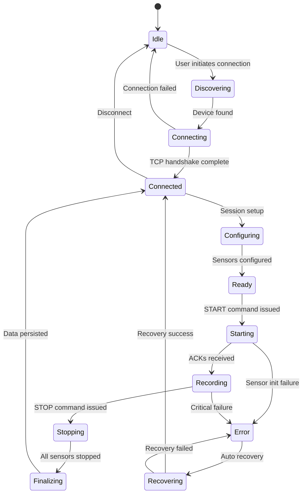

# Chapter 3: Recording Control State Machine

## Figure 3.2: Software State Machine for Recording Control

```mermaid
stateDiagram-v2
    [*] --> Idle
    Idle --> Discovering : User initiates connection
    Discovering --> Connecting : Device found
    Connecting --> Connected : TCP handshake complete
    Connecting --> Idle : Connection failed
    Connected --> Configuring : Session setup
    Configuring --> Ready : Sensors configured
    Ready --> Starting : START command issued
    Starting --> Recording : ACKs received
    Starting --> Error : Sensor init failure
    Recording --> Stopping : STOP command issued
    Recording --> Error : Critical failure
    Stopping --> Finalizing : All sensors stopped
    Finalizing --> Connected : Data persisted
    Error --> Recovering : Auto recovery
    Recovering --> Connected : Recovery success
    Recovering --> Error : Recovery failed
    Connected --> Idle : Disconnect
```
