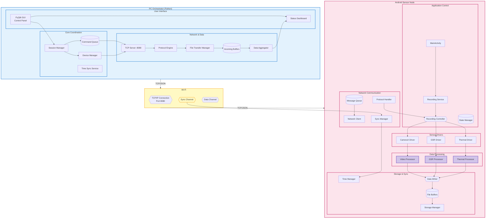

# Chapter 3: System Design and Architecture

## Figure 3.1: System Architecture Diagram

```mermaid
flowchart TB
    subgraph PC["PC Orchestrator (Python)"]
        subgraph UI["User Interface"]
            GUI[PyQt6 GUI<br/>Control Panel]
            StatusDisplay[Status Dashboard]
        end
        subgraph Core["Core Coordination"]
            SessionMgr[Session Manager]
            DeviceMgr[Device Manager]
            TimeSyncSvc[Time Sync Service]
            CommandQueue[(Command Queue)]
        end
        subgraph NetData["Network & Data"]
            NetServer[TCP Server :8080]
            ProtocolEngine[Protocol Engine]
            DataAggregator[Data Aggregator]
            FileReceiver[File Transfer Manager]
            DataCache[(Incoming Buffers)]
        end
        GUI --> SessionMgr
        GUI --> StatusDisplay
        SessionMgr --> DeviceMgr
        SessionMgr --> CommandQueue
        CommandQueue --> NetServer
        DeviceMgr --> NetServer
        NetServer --> ProtocolEngine --> FileReceiver --> DataCache --> DataAggregator
        DataAggregator --> StatusDisplay
    end

    subgraph Network["Wi-Fi"]
        TCPConnection{{TCP/IP Connection<br/>Port 8080}}
        SyncChannel{{Sync Channel}}
        DataChannel{{Data Channel}}
    end

    subgraph Android["Android Sensor Node"]
        subgraph Control["Application Control"]
            MainActivity[MainActivity]
            RecordingService[Recording Service]
            RecordingController{{Recording Controller}}
            StateManager[(State Manager)]
        end
        subgraph NetComm["Network Communication"]
            NetClient[Network Client]
            ProtocolHandler[Protocol Handler]
            SyncClient[Sync Manager]
            MessageQueue[(Message Queue)]
        end
        subgraph SensorLayer["Sensor Drivers"]
            ThermalDriver[Thermal Driver]
            GSRDriver[GSR Driver]
            CameraDriver[CameraX Driver]
        end
        subgraph DataProc["Data Processing"]
            ThermalProc[Thermal Processor]
            GSRProc[GSR Processor]
            VideoProc[Video Processor]
        end
        subgraph Storage["Storage & Sync"]
            TimeManager[Time Manager]
            StorageMgr[Storage Manager]
            DataWriter{{Data Writer}}
            FileBuffer[(File Buffers)]
        end
        MainActivity --> RecordingService --> RecordingController
        RecordingController --> ThermalDriver
        RecordingController --> GSRDriver
        RecordingController --> CameraDriver
        ThermalDriver --> ThermalProc --> DataWriter
        GSRDriver --> GSRProc --> DataWriter
        CameraDriver --> VideoProc --> DataWriter
        DataWriter --> FileBuffer --> StorageMgr
        SyncClient --> TimeManager
        ProtocolHandler --> RecordingController
        MessageQueue --> NetClient
    end

    PC -->|TCP/JSON| Network -->|TCP/JSON| Android
    SyncChannel --> SyncClient

    classDef pcClass fill:#e3f2fd,stroke:#1976d2,stroke-width:2px
    classDef androidClass fill:#fce4ec,stroke:#c2185b,stroke-width:2px
    classDef networkClass fill:#fff9c4,stroke:#f9a825,stroke-width:2px
    classDef processClass fill:#d1c4e9,stroke:#673ab7,stroke-width:2px

    class PC,UI,Core,NetData pcClass
    class Android,Control,NetComm,SensorLayer,DataProc,Storage androidClass
    class Network,SyncChannel networkClass
    class ThermalProc,GSRProc,VideoProc processClass
```
