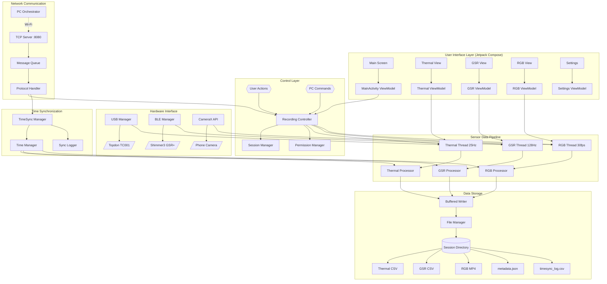

# Chapter 4: Implementation and Development

## Figure 4.1: Mobile App UI and Data Flow

```mermaid
graph TB
    subgraph UI["User Interface Layer (Jetpack Compose)"]
        MainScreen[Main Screen] --> MainVM[MainActivity ViewModel]
        ThermalUI[Thermal View] --> ThermalVM[Thermal ViewModel]
        GSRUI[GSR View] --> GSRVM[GSR ViewModel]
        RGBUI[RGB View] --> RGBVM[RGB ViewModel]
        SettingsUI[Settings] --> SettingsVM[Settings ViewModel]
    end

    subgraph Control["Control Layer"]
        UserAction{{User Actions}}
        PCCommand{{PC Commands}}
        RecordingController[Recording Controller]
        SessionManager[Session Manager]
        PermissionManager[Permission Manager]
        UserAction --> RecordingController
        PCCommand --> RecordingController
        RecordingController --> SessionManager
        RecordingController --> PermissionManager
    end

    subgraph Hardware["Hardware Interface"]
        USBManager[USB Manager] --> TC001Device[/Topdon TC001/]
        BLEManager[BLE Manager] --> Shimmer3Device[/Shimmer3 GSR+/]
        CameraXAPI[CameraX API] --> RGBCamera[/Phone Camera/]
    end

    subgraph Pipeline["Sensor Data Pipeline"]
        ThermalThread[Thermal Thread 25Hz]
        GSRThread[GSR Thread 128Hz]
        RGBThread[RGB Thread 30fps]
        ThermalProcessor[Thermal Processor]
        GSRProcessor[GSR Processor]
        RGBProcessor[RGB Processor]
        ThermalThread --> ThermalProcessor
        GSRThread --> GSRProcessor
        RGBThread --> RGBProcessor
    end

    subgraph TimeSync["Time Synchronization"]
        TimeSyncManager[TimeSync Manager] --> TimeManager[Time Manager]
        TimeSyncManager --> SyncLogger[Sync Logger]
    end

    subgraph Storage["Data Storage"]
        BufferedWriter[Buffered Writer]
        FileManager[File Manager]
        SessionDir[(Session Directory)]
        ThermalFile[Thermal CSV]
        GSRFile[GSR CSV]
        RGBFile[RGB MP4]
        MetaFile[metadata.json]
        SyncFile[timesync_log.csv]
        BufferedWriter --> FileManager --> SessionDir
        SessionDir --> ThermalFile
        SessionDir --> GSRFile
        SessionDir --> RGBFile
        SessionDir --> MetaFile
        SessionDir --> SyncFile
    end

    subgraph Network["Network Communication"]
        PCOrchestrator[PC Orchestrator]
        TCPServer[TCP Server :8080]
        ProtocolHandler[Protocol Handler]
        MessageQueue[Message Queue]
        PCOrchestrator -. Wi-Fi .-> TCPServer
        TCPServer --> MessageQueue --> ProtocolHandler
    end

    MainVM --> RecordingController
    ThermalVM --> ThermalThread
    GSRVM --> GSRThread
    RGBVM --> RGBThread
    RecordingController --> ThermalThread
    RecordingController --> GSRThread
    RecordingController --> RGBThread
    ProtocolHandler --> RecordingController
    ProtocolHandler --> TimeSyncManager
    USBManager --> ThermalThread
    BLEManager --> GSRThread
    CameraXAPI --> RGBThread
    TimeManager --> ThermalProcessor
    TimeManager --> GSRProcessor
    TimeManager --> RGBProcessor
    ThermalProcessor --> BufferedWriter
    GSRProcessor --> BufferedWriter
    RGBProcessor --> BufferedWriter
```
