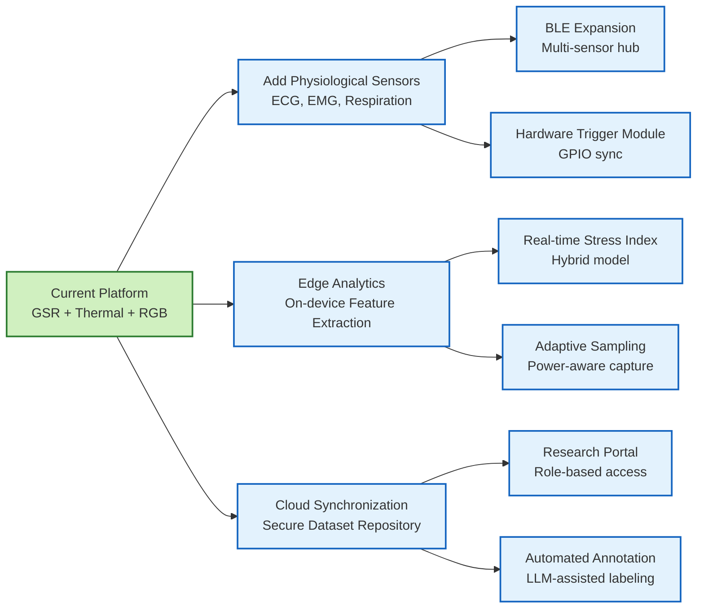

# Chapter 6: Proposed Future System Enhancements

## Figure 6.1: Future Expansion Roadmap

Roadmap highlights near-term expansions: integrating additional physiological sensors, deploying
edge analytics, and enabling cloud-based collaboration.
