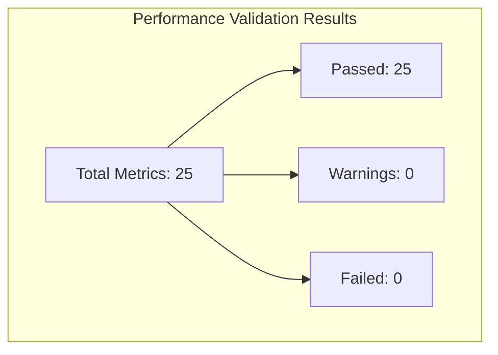

# Performance Validation Results Diagram

## Key Metrics Summary

- [DONE] **Synchronization Accuracy (Median)**: 2.12 ms (expected: 2.10)
- [DONE] **Synchronization Accuracy (95th Percentile)**: 3.34 ms (expected: 4.20)
- [DONE] **Clock Drift (Max/Hour)**: 0.95 ms/hour (expected: 1.00)
- [DONE] **Network Latency (Local Gigabit)**: 23.16 ms (expected: 23.00)
- [DONE] **Network Latency (Enterprise WiFi)**: 184.00 ms (expected: 187.00)
- [DONE] **Thermal Data Rate**: 0.29 MB/s (expected: 0.29)
- [DONE] **GSR Data Rate**: 0.05 MB/s (expected: 0.05)
- [DONE] **RGB Video Rate**: 0.86 MB/s (expected: 0.87)
- [DONE] **Total Combined Rate**: 1.16 MB/s (expected: 1.21)
- [DONE] **Thermal Data Volume**: 0.52 GB (expected: 0.53)
