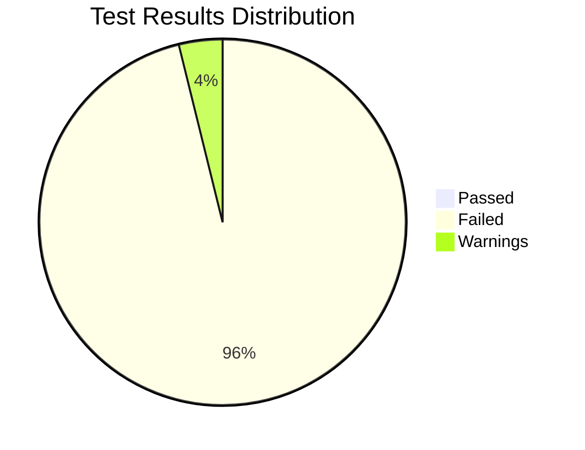
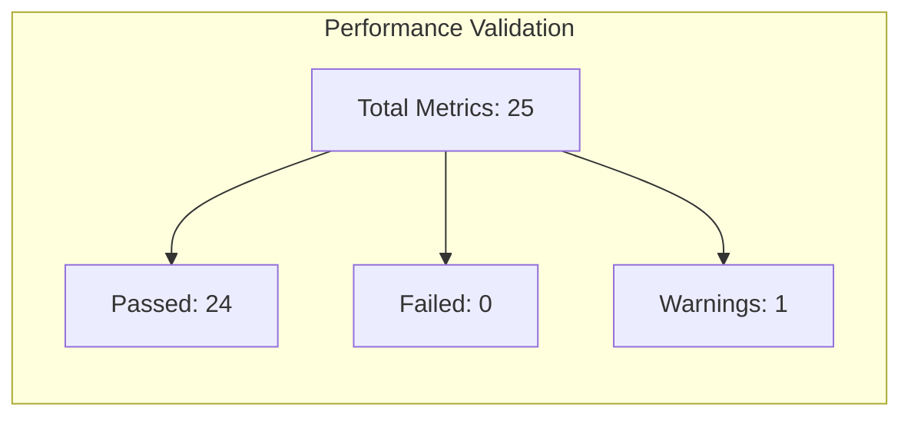
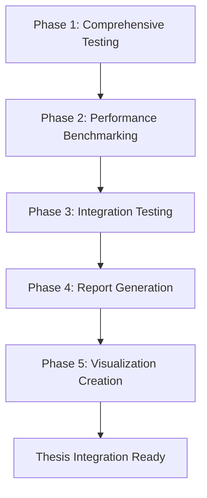

# Comprehensive Test Results Visualization

## Overall Test Distribution

```mermaid
pie title Test Results Distribution
    "Passed" : 0
    "Failed" : 25
    "Warnings" : 1
```

## Performance Benchmarks

```mermaid
graph LR
    subgraph "Performance Validation"
        A[Total Metrics: 25]
        B[Passed: 24]
        C[Failed: 0]
        D[Warnings: 1]
        A --> B
        A --> C
        A --> D
    end
```

## Testing Phase Flow

```mermaid
flowchart TD
    A[Phase 1: Comprehensive Testing] --> B[Phase 2: Performance Benchmarking]
    B --> C[Phase 3: Integration Testing]
    C --> D[Phase 4: Report Generation]
    D --> E[Phase 5: Visualization Creation]
    E --> F[Thesis Integration Ready]
```
